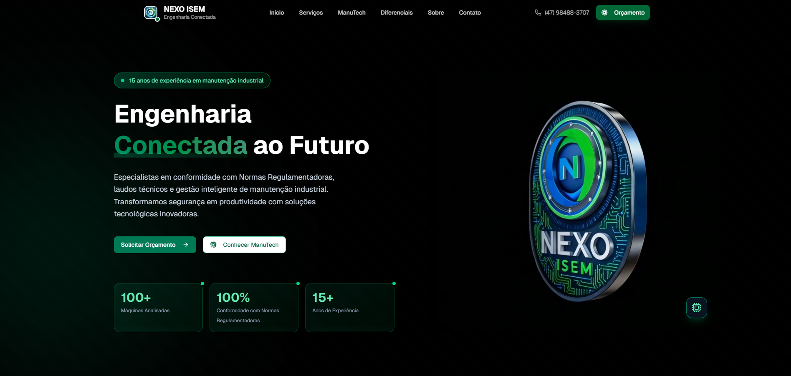

# NEXO ISEM Landing Page

## Preview da Demo

> Imagem principal da landing page.

<p align="center">
  
</p>

Landing page institucional da **NEXO ISEM**, desenvolvida com **Next.js 16**, com foco em:
- apresentação da empresa e fundadores;
- divulgação de serviços e diferenciais;
- destaque do produto **ManuTech**;
- captação de leads via seção de contato.

## Stack

- Next.js 16 (App Router)
- React 19
- TypeScript
- Tailwind CSS 4
- Lucide React (ícones)

## Seções da página

A composição da landing está em `app/page.tsx`:

1. `Header`
2. `Hero`
3. `Services`
4. `ManuTech`
5. `Differentials`
6. `About`
7. `Contact`
8. `Footer`

## Estrutura relevante

```txt
app/
  layout.tsx
  page.tsx
  globals.css

components/landing/
  header.tsx
  hero.tsx
  services.tsx
  manutech.tsx
  differentials.tsx
  about.tsx
  contact.tsx
  footer.tsx
```

## Como rodar localmente

### Pré-requisitos

- Node.js 20+ (recomendado)
- npm

### Instalação e execução

```bash
npm install
npm run dev
```

A aplicação ficará disponível em `http://localhost:3000`.

## Scripts

- `npm run dev` inicia ambiente de desenvolvimento
- `npm run build` gera build de produção
- `npm run start` inicia a aplicação em produção
- `npm run lint` executa lint (requer ESLint instalado/configurado no ambiente)

## Customização rápida

Para editar conteúdo e visual, use:

- **Hero:** `components/landing/hero.tsx`
- **ManuTech:** `components/landing/manutech.tsx`
- **Diferenciais:** `components/landing/differentials.tsx`
- **Sobre:** `components/landing/about.tsx`
- **Rodapé:** `components/landing/footer.tsx`

## Observações

- O layout usa fontes Google via `next/font/google` em `app/layout.tsx` (`Geist` e `Geist Mono`).
- Em ambientes sem acesso à internet, o `npm run build` pode falhar ao baixar essas fontes.
